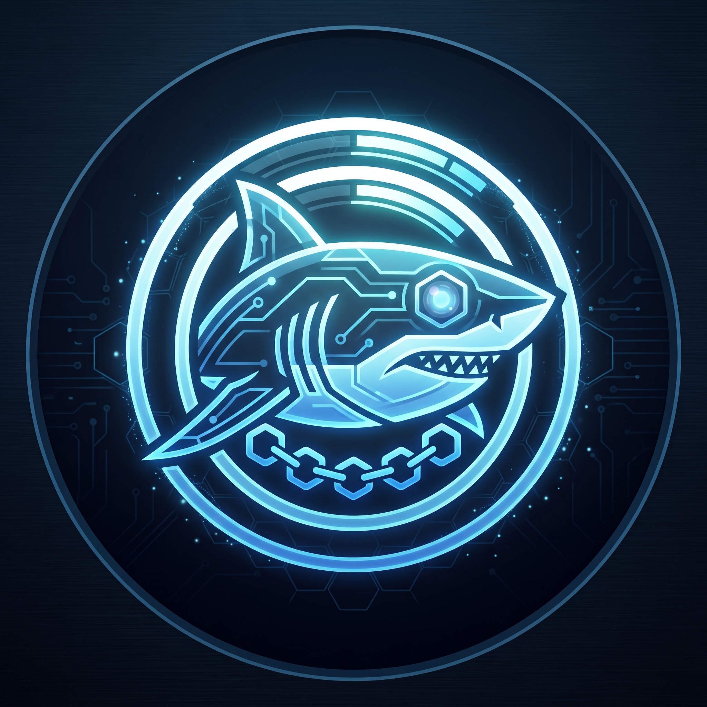

<p align="center">
  
</p>

# Bot de Engajamento & Acompanhamento de Bolsistas do Discord (CIIA/DF)

Bot desenvolvido para o **Centro Integrado de Inteligência Artificial do DF (CIIA/DF)**, combinando acompanhamento de produtividade de bolsistas (standup diário, meta de 20h/semana em dias úteis), gerenciamento de acervo de arquivos/conteúdos e engajamento da comunidade de IA.

---

## Funcionalidades Principais

### Cadastro Obrigatório
- **`/cadastrar`**: Primeiro passo obrigatório para usar qualquer outro comando do bot. O usuário escolhe entre **Bolsista NIA/UnDF**, **Coordenador** ou **Admin**.
- **Admin restrito**: A categoria **Admin** só é aceita para IDs configurados em `ADMIN_USER_IDS`.
- **Permissões internas**: Bolsistas usam os fluxos de daily/conteúdo; coordenadores também exportam relatórios e adicionam projetos; admins podem alterar cadastros e moderar registros.

### Expediente e Produtividade dos Bolsistas
- **`/daily` (Standup Diário em Modal)**: Formulário interativo para registrar horas trabalhadas no dia (com suporte a horários partidos), um ou mais projetos vinculados, atividades realizadas, metas para o próximo dia útil e bloqueios/impedimentos.
- **`/editar-daily`**: Permite corrigir a própria daily do dia atual.
- **`/minha-semana`**: Mostra o resumo individual da semana, incluindo horas, progresso até 20h, projetos citados e registros enviados.
- **Frequência em Dias Úteis**: O contador de dias seguidos (*streak*) opera de **segunda a sexta-feira**. Finais de semana não quebram a sequência do bolsista.
- **Meta de 20 Horas Semanais**: Barra de progresso visual em tempo real no perfil e na daily (`X / 20.0h`).
- **Lembrete Inteligente**: Bolsistas cadastrados que ainda não fizeram daily recebem DM às 17h em dias úteis.
- **Resumo Semanal Automático**: Toda sexta-feira às 15h, o bot publica um resumo breve no canal configurado em `WEEKLY_SUMMARY_CHANNEL_ID`.

### Gerenciamento de Arquivos e Conteúdos
- **`/registrar-conteudo`**: Formulário para bolsistas registrarem novos arquivos de documentação, posts para redes sociais ou referências.
- **`/conteudos`**: Visualização e listagem do acervo de conteúdos registrados, com suporte a filtro opcional por membro (`/conteudos @usuario`).
- **Moderação Integrada**: Botões interativos para administradores removerem registros diretamente do Discord.

### Perfil & Gamificação
- **`/perfil`**: Exibe a foto, nível de contribuição (XP), horas acumuladas na semana, sequência de dailies e conquistas (*badges*).
- **`/ranking`**: Leaderboard com os membros mais ativos do servidor.
- **Badges Iniciais**:
  - **Primeiros Passos**: Registrou a 1ª daily.
  - **Imparável**: 5 dias úteis seguidos de daily (uma semana completa).
  - **Meta 20h Concluída**: Cumpriu as 20 horas na semana.
  - **Contribuidor IA**: Compartilhou conteúdo relevante com a comunidade.

### Comunidade & IA
- **`/projetos` & `/adicionar-projeto`**: Apresenta as frentes de atuação e permite cadastrar novos projetos ativos do CIIA/DF.
- **`/exportar-dailies`**: Coordenadores e admins exportam CSV do mês atual por padrão, com suporte a intervalo de datas.
- **`/compartilhar`**: Compartilha artigos, benchmarks, notícias e ferramentas de IA com a comunidade.
- **`/ajuda`**: Guia interativo para novos membros e bolsistas.

---

## 📊 Dashboard Web de Métricas (Interface Visual)

O projeto conta com um **Dashboard Web completo em Dark Mode High-End** para visualização e análise em tempo real das métricas de produtividade do **CIIA/DF**.

### Como Acessar:
Ao iniciar o projeto com `npm start` ou `npm run dashboard`, acesse no seu navegador:
👉 **[http://localhost:3000](http://localhost:3000)**

### Abas & Funcionalidades do Dashboard:
- 📈 **Visão Geral**: 5 Cards KPI em tempo real (Total Horas, Dailies Enviadas, Bolsistas Ativos, % de Cumprimento da Meta de 20h e Acervo), Gráfico de Evolução Diária (Chart.js), Gráfico de Distribuição por Projeto e Feed de Atividades Recentes.
- 🎓 **Bolsistas & Alunos**: Grid/Tabela de alunos com busca por nome, progresso dinâmico da meta de 20h na semana, streak flame, badges e **modal de perfil detalhado** com linha do tempo de standups.
- 📋 **Dailies & Entregas**: Tabela interativa com busca em tempo real e filtro por projeto, exibindo horas, tarefas concluídas, metas e bloqueios.
- 🚀 **Projetos**: Cards visuais com estatísticas por iniciativa (horas acumuladas, total de relatórios, bolsistas participantes e maior contribuidor).
- 📚 **Acervo de Conteúdos**: Galeria filtrável por categorias (*Artigo, Benchmark, Ferramenta, Documentação*) com atalhos diretos.
- 🏆 **Rankings & Conquistas**: Pódio tridimensional dos Top 3 bolsistas e tabelas de classificação por XP, Streak e Carga Horária.

### APIs REST Disponíveis:
- `GET /api/metrics/summary`: Resumo dos KPIs globais.
- `GET /api/metrics/trends`: Histórico temporal de horas e dailies.
- `GET /api/metrics/projects`: Distribuição de horas por projeto.
- `GET /api/students`: Métricas consolidadas dos bolsistas.
- `GET /api/students/:id`: Perfil e histórico individual do bolsista.
- `GET /api/dailies`: Relatórios diários com filtros e busca.
- `GET /api/projects`: Estatísticas de cada projeto.
- `GET /api/contents`: Materiais e links salvos no acervo.
- `GET /api/rankings`: Tabelas de gamificação e classificação.

---

## Passo a Passo para Colocar o Bot Online

### 1. Criar o Bot no Discord Developer Portal
1. Acesse o [Discord Developer Portal](https://discord.com/developers/applications).
2. Clique em **New Application**, dê o nome de `Shark_CIIA` e clique em **Create**.
3. No menu lateral esquerdo, vá em **Bot**:
   - Clique em **Reset Token** e **Copie o Token** gerado (guarde com segurança!).
   - Em **Privileged Gateway Intents**, ative as opções:
     - **PRESENCE INTENT**
     - **SERVER MEMBERS INTENT**
     - **MESSAGE CONTENT INTENT**
4. No menu lateral esquerdo, vá em **OAuth2 -> URL Generator**:
   - Marque a checkbox **`bot`** e **`applications.commands`**.
   - Em *Bot Permissions*, marque **Administrator** (ou *Send Messages*, *Embed Links*, *Use Slash Commands*).
   - Copie o URL gerado na parte inferior e abra no seu navegador para **adicionar o Bot ao servidor do CIIA/DF**.

---

### 2. Configurar o Arquivo `.env`
No diretório do projeto, crie ou edite o arquivo `.env` copiando o modelo `.env.example`:

```env
# Token do Bot (obtido no menu Bot)
DISCORD_TOKEN=seu_token_aqui

# Client ID da Aplicação (obtido no menu General Information)
CLIENT_ID=seu_client_id_aqui

# (Opcional) ID do servidor de testes para registro instantâneo dos comandos slash
GUILD_ID=seu_guild_id_aqui

# (Opcional) ID do canal do Discord onde as dailies públicas serão postadas (ex: #standup-bolsistas)
DAILY_CHANNEL_ID=seu_canal_id_aqui

# (Opcional) ID do canal onde o resumo semanal será postado às sextas, 15h
WEEKLY_SUMMARY_CHANNEL_ID=seu_canal_resumo_id_aqui

# (Opcional) ID do canal do Discord onde os registros de acervo/arquivos serão postados
ARCHIVE_CHANNEL_ID=seu_canal_arquivo_id_aqui

# IDs dos usuários que podem se cadastrar como Admin
ADMIN_USER_IDS=seu_id_discord,gustavo_id_discord
```

---

### 3. Registrar os Comandos Slash no Discord
Execute o comando de deploy para registrar os comandos no Discord:

```bash
npm run deploy
```

---

### 4. Iniciar o Bot
Para rodar o bot:

```bash
npm start
```

Você verá a mensagem:
`Bot CIIA/DF online como Shark_CIIA#1234!`

---

## Comandos Úteis de Desenvolvimento

```bash
# Iniciar o Bot do Discord e o Dashboard Web simultaneamente:
npm start

# Executar apenas o Dashboard Web na porta 3000:
npm run dashboard

# Executar a suíte de testes de validação completa (banco + comandos + embeds)
npm run test-bot

# Testar apenas a lógica do banco de dados SQLite
npm run test-db
```

---

## Estrutura do Código

- `src/index.js`: Ponto de entrada principal (Bot Discord + Servidor do Dashboard Web).
- `src/server.js`: Servidor HTTP Express com rotas de API REST de métricas e hospedagem do Dashboard Web.
- `src/database.js`: Banco SQLite com suporte a dias úteis, cálculo de streak, horas semanais, XP, acervo de conteúdos e agregações para o Dashboard.
- `src/utils/embeds.js`: Construtores de Modals e Embeds estilizados com o tema do CIIA/DF.
- `src/utils/dates.js`: Utilitários para tratamento de datas, dias úteis e fusos horários.
- `src/commands/`: Módulos de comandos Slash (`/cadastrar`, `/alterar-cadastro`, `/daily`, `/editar-daily`, `/minha-semana`, `/exportar-dailies`, `/perfil`, `/projetos`, `/adicionar-projeto`, `/ranking`, `/registrar-conteudo`, `/conteudos`, `/compartilhar`, `/ajuda`).
- `public/`: Frontend estático do Dashboard Web (`index.html`, `css/dashboard.css`, `js/dashboard.js`).

